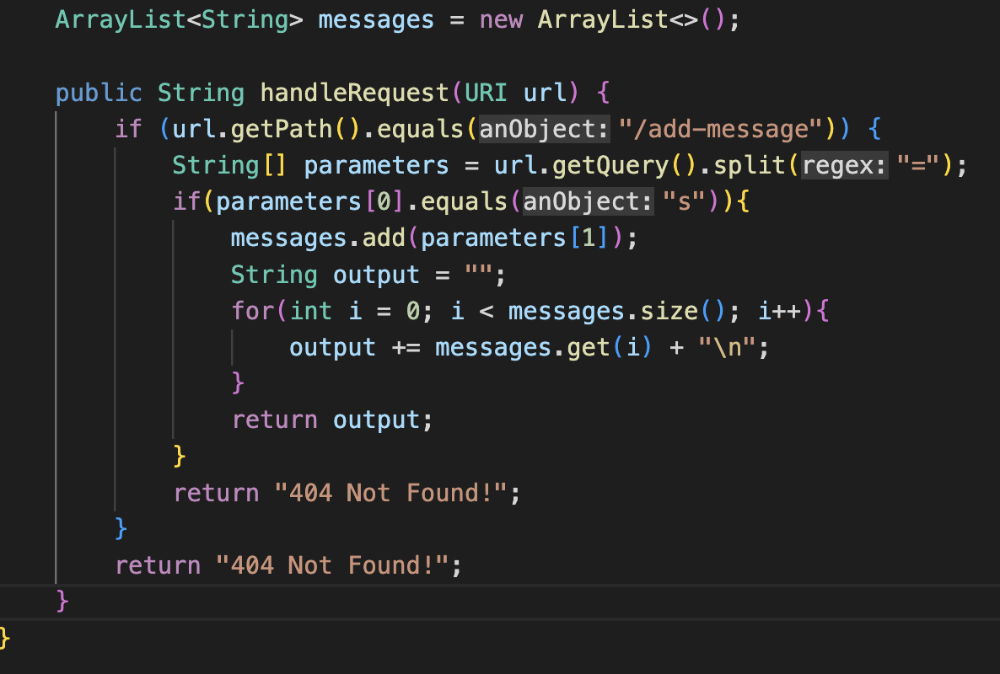

# Lab Report 2 - Servers and Bugs
## Part 1 - StringServer 
The StringServer should use the path and query in the url to print and concatenate strings from incoming requests.  
For example inputing the url http://localhost:4000/add-message?s=HelloWorld would print:  

* **Which methods in your code are called?**  
  Processing the url request calls the handleRequest method in my code  
    
* **What are the relevant arguments to those methods, and the values of any relevant fields of the class?**  
  The only argument in handleRequest is the url. Using the url, the method then uses the url to create values that are used in the code. The relevant         values in this class include:
    * ArrayList messages - An ArrayList that keeps track of the strings inputed
    * url.getPath() - The path of the url
    * String[] parameters - The query of the url split by = 
    * messages.size() - The amount of strings in messages
    * output - The output returned to the server
* **How do the values of any relevant fields of the class change from this specific request? If no values got changed, explain why**  
  All the relevant values get changed from this specific request:
    * ArrayList messages - Changes from an empty list to having the string HelloWorld in it
    * url.getPath() - Since this is the first string added, the path changes from just / to /add-message
    * String[] parameters - parameters gets initalized to the new query so it becomes {s, HelloWorld}
    * messages.size() - The size of the list gets increased from 0 to 1
    * output - The output changes by going from nothing to HelloWorld

Now we can add a second message to display. Inputing http://localhost:4000/add-message?s=Goodbye would print:  

* **Which methods in your code are called?**  
  Processing the url request calls the handleRequest method in my code  
  
* **What are the relevant arguments to those methods, and the values of any relevant fields of the class?**  
  The only argument in handleRequest is the url. Using the url, the method then uses the url to create values that are used in the code. The relevant         values in this class include:
    * **ArrayList messages** - An ArrayList that keeps track of the strings inputed
    * **url.getPath()** - The path of the url
    * **String[] parameters** - The query of the url split by = 
    * **messages.size()** - The amount of strings in messages
    * **output** - The output returned to the server
* **How do the values of any relevant fields of the class change from this specific request? If no values got changed, explain why**  
  All the relevant values get changed from this specific request except url.getPath()
    * **ArrayList messages** - The ArrayList adds the string Goodbye to the list so it now has HelloWorld and Goodbye
    * **url.getPath()** - The path of the url is the same as the last request so it still is /add-message
    * **String[] paramters** - parameters gets initalized in every request so it becomes {s, Goodbye}
    * **messages.size()** - The size of the list gets increased from 1 to 2
    * **output** - The output changes by going from just HelloWorld to HelloWorld + \n + Goodbye which prints HelloWorld and then prints Goodbye on a new         line
  
