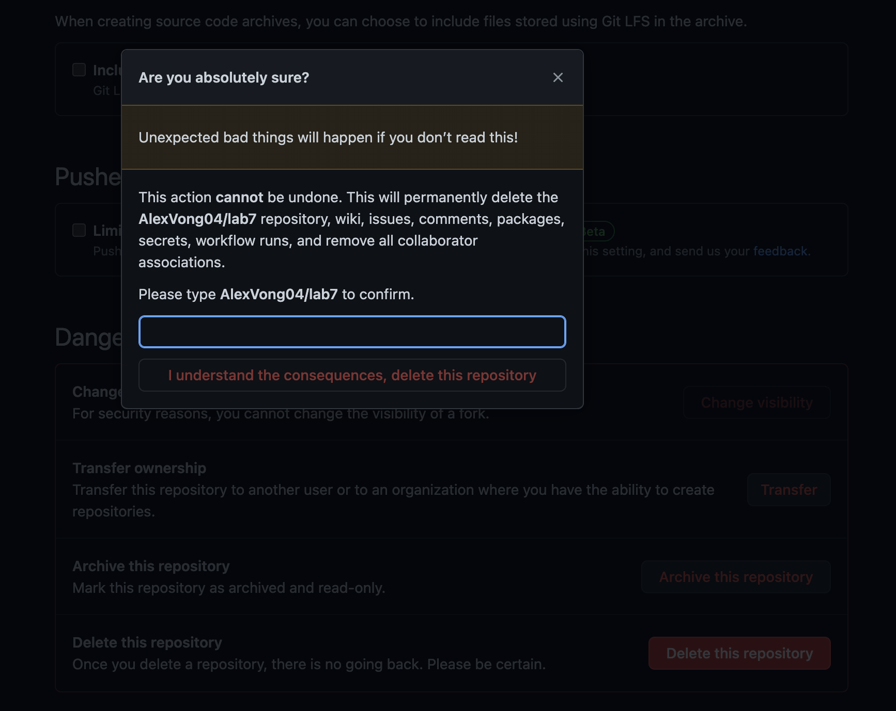
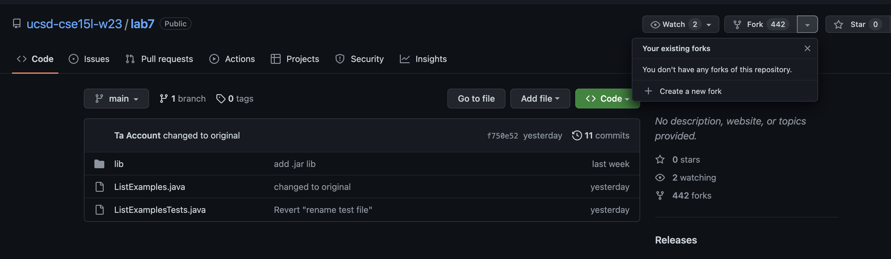
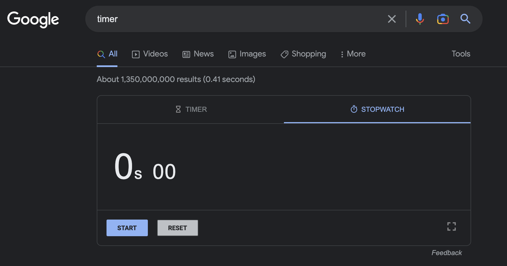
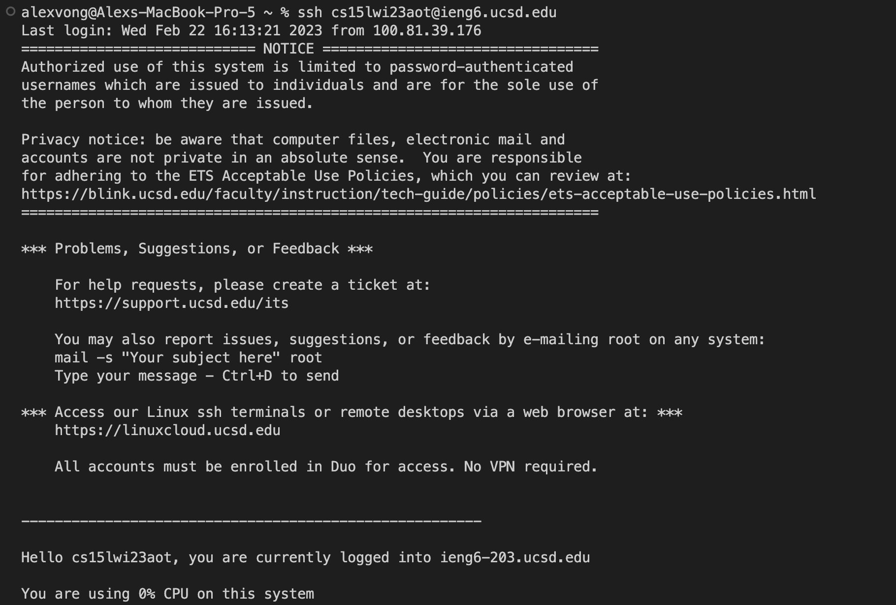
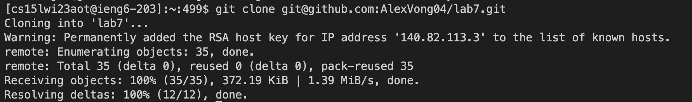
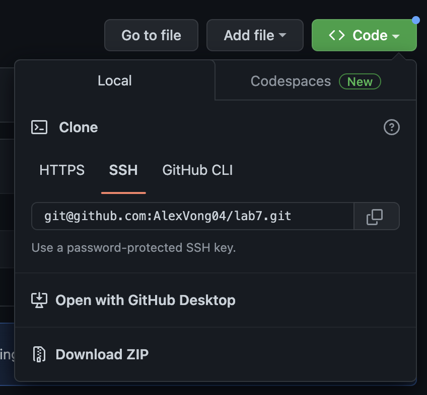
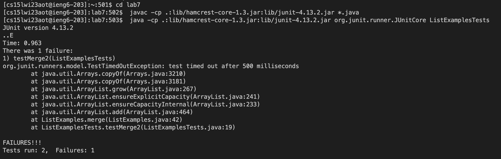
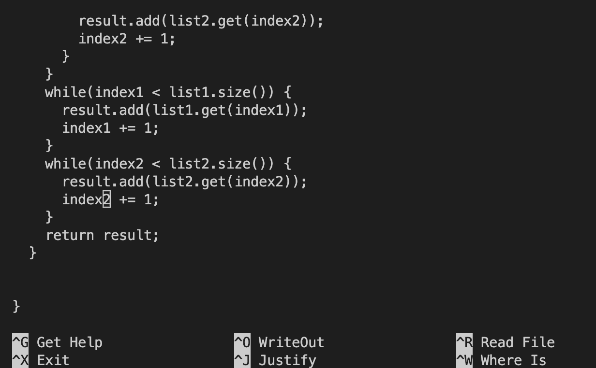
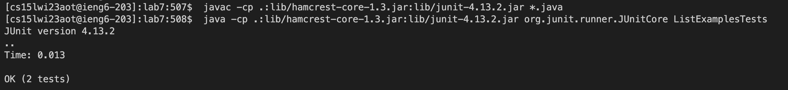
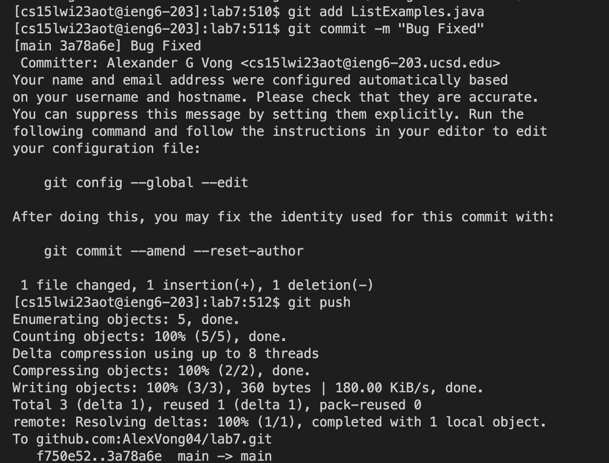

# Lab Report 4
## Step 1 (Setup) - Delete Any Existing Forks of the Repository You Have on Your Account

If you have an existing fork of the repository, go to that repository, click on the settings button. After you go to the settings, scroll all the way
down and press delete this repository. After that it will ask you to type your repository name to confirm the deletion. <br>

**Explaination:** <br>
You need to delete the existing fork of the repository because one of the tasks require you to clone the repository. This task does not count for the
actual time.
## Step 2(Setup) - Fork the repository

Go this link (https://github.com/ucsd-cse15l-w23/lab7) and click the fork button. Then click the green create fork button to finalize the fork. <br>

**Explaination:** <br>
This step is important for the setup of the tasks because it lets you be able to modify files of lab7 without changing the original.  
## Step 3 (Setup) - Start the timer!

Go to Google and type stopwatch and press enter. <br>

**Explaination:** <br>
This is the last setup step for your timed skill demo before you start the actual tasks. This is allow you to measure how fast you finish all your
tasks.
## Step 4 - Log into ieng6

Keys Pressed: Control C, Control V, ``` <enter>```

**Explaination** <br>
To do this task faster, I had a tab open that contained the command to ssh into my account. So I used control C and control V to copy and paste the
command into my terminal and pressed enter to run it. 
## Step 5 - Clone your fork of the repository from your Github account
  <br>
Keys Pressed: Control C, git clone, Control V, ```<enter>``` <br>

**Explaination** <br>
To clone the repository faster, I used control C to copy repository link. I then typed out git clone in the terminal, used 
control V to paste the link, and pressed enter to run the command.
## Step 6 - Run the tests, demonstrating that they fail

Keys Pressed: cd l ```<tab>```, ```<enter>```, Control C, Control V, ```<enter>```, Control C, Control V, ```<enter>``` <br>

**Explaination** <br>
To run the tests, you need to go into the lab7 directory. To do this faster, I used cd l and then pressed tab to autofill the lab7 part. To run the
Junit tests, I had the compile and run commands on another tab so I just used control C and control V twice to run both of those commands.
## Step 7 - Edit the code file to fix the failing test

Keys Presed: nano L ```<tab>```, .java, ```<enter>```, Control W, +=, ```<enter>```, Control W, ```<enter>```, Control W, <br>
```<enter>```, Control W, ```<enter>```, ```<left>```, ```<backspace>```, 2, Control O, ```<enter>```, Control X <br>

**Explaination** <br>
To edit the ListExamples.java file I used nano L and pressed tab to fill in the ListExamples. Then typed .java to complete the file name and pressed
enter. To get to where I wanted to edit I used control W to find the first += and used control W three more times to find the fourth instance of +=.
I then pressed left to get to exactly where I wanted to edit, deleted the 1 in index1 and replaced it with 2. To save the file I used control o, 
and to exit nano I used control x.
## Step 8 - Run the tests, demonstrating that they now succeed

Keys Pressed: ```<up>```, ```<up>```, ```<up>```, ```<enter>```, ```<up>```, ```<up>```, ```<up>```, ```<enter>``` <br>

**Explaination** <br>
Since the compile command was the third most recent command I ran, I just pressed up three times to get that command and pressed enter to compile.
After I complied, the run command for the Junit tests was the third most recent command I ran so I did the same thing and pressed up three times
to get the run command and pressed enter to run.
## Step 9 - Commit and push the resulting change to your Github account

Keys Pressed: git add L ```<tab>```, .java, ```<enter>```, git commit -m "Bug Fixed", ```<enter>```, git push, ```<enter>``` <br>

**Explaination** <br>
To first add the changes I made, I used the git add command and typed L then tab to fill in the ListExamples. Then I typed .java to complete the 
file name and pressed enter. To commit the change I typed git commit -m "Bug Fixed" to commit the change with a message of Bug Fixed. I then pushed
the changes to github by typing git push and pressing enter.
