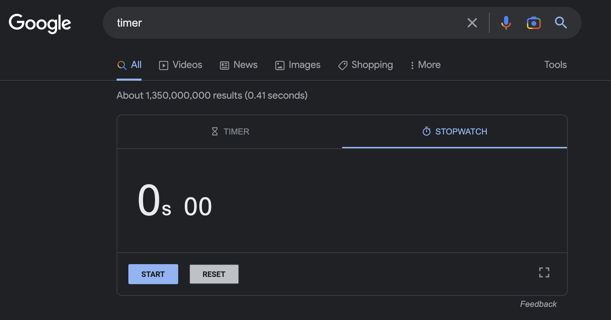
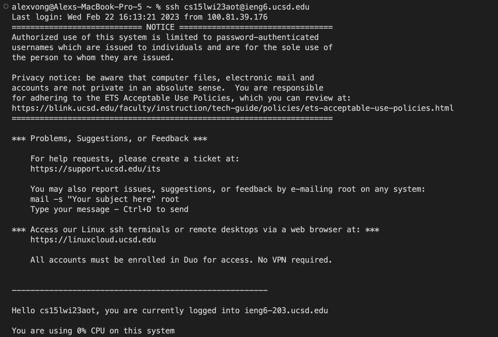

# Lab Report 5 - Lab Report 4 Alternative Approach
## Step 1 (Setup) - Delete Any Existing Forks of the Repository You Have on Your Account

If you have an existing fork of the repository, go to that repository, click on the settings button. After you go to the settings, scroll all the way
down and press delete this repository. After that it will ask you to type your repository name to confirm the deletion. <br>

**Explaination:** <br>
You need to delete the existing fork of the repository because one of the tasks require you to clone the repository. This task does not count for the
actual time.
## Step 2(Setup) - Fork the repository

Go this link (https://github.com/ucsd-cse15l-w23/lab7) and click the fork button. Then click the green create fork button to finalize the fork. <br>

**Explaination:** <br>
This step is important for the setup of the tasks because it lets you be able to modify files of lab7 without changing the original.  
## Step 3 (Setup) - Start the timer!

Go to Google and type stopwatch and press enter. <br>

**Explaination:** <br>
This is the last setup step for your timed skill demo before you start the actual tasks. This is allow you to measure how fast you finish all your
tasks.
## Step 4 - Log into ieng6

Keys Pressed: Control C, Control V, ``` <enter>```

**Explaination** <br>
To do this task faster, I had a tab open that contained the command to ssh into my account. So I used control C and control V to copy and paste the
command into my terminal and pressed enter to run it. 

## Step 5 - Run First Bash Script


Keys Pressed: bash comp.sh ```<enter>```

**Explaination** <br>
This bash script clones the repository, goes into the repository, runs the tests, and goes to nano ListExamples.java <br>

## Step 6 - Edit the code file to fix the failing test

Keys Pressed: nano L ```<tab>```, .java, ```<enter>```, Control W, +=, ```<enter>```, Control W, ```<enter>```, Control W, <br>
```<enter>```, Control W, ```<enter>```, ```<left>```, ```<backspace>```, 2, Control O, ```<enter>```, Control X <br>

**Explaination** <br>
To edit the ListExamples.java file I used nano L and pressed tab to fill in the ListExamples. Then typed .java to complete the file name and pressed
enter. To get to where I wanted to edit I used control W to find the first += and used control W three more times to find the fourth instance of +=.
I then pressed left to get to exactly where I wanted to edit, deleted the 1 in index1 and replaced it with 2. To save the file I used control o, 
and to exit nano I used control x. <br>

## Step 7 - Run Second Bash Script

 
Kets Pressed: bash finish.sh ```<enter>```

**Explaination** <br>
This bash script runs the tests and commits and pushes the changes to github


