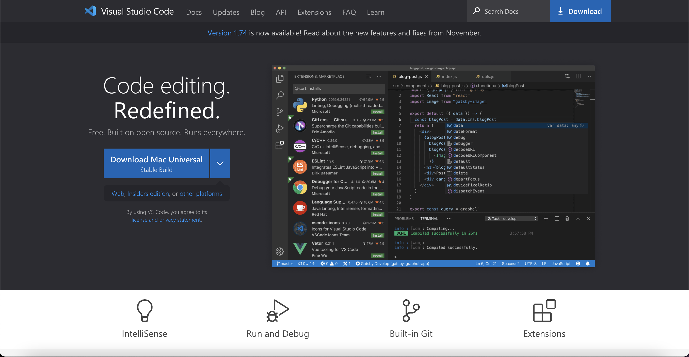
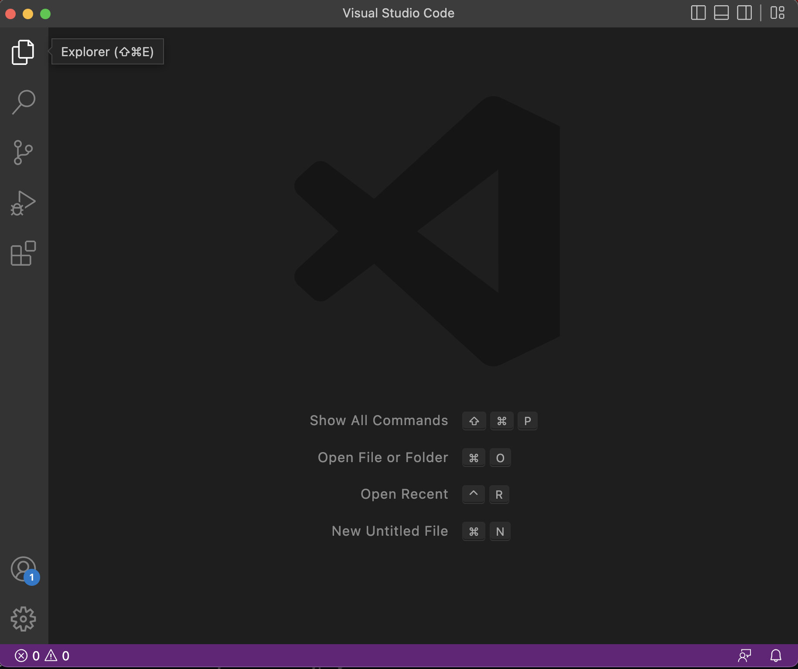
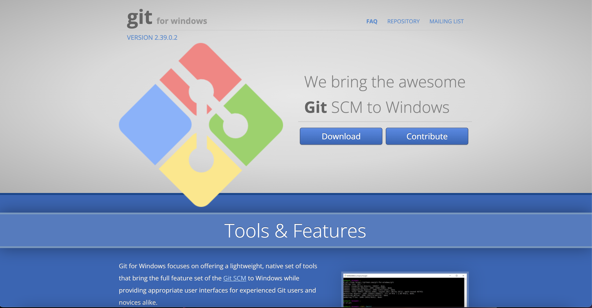
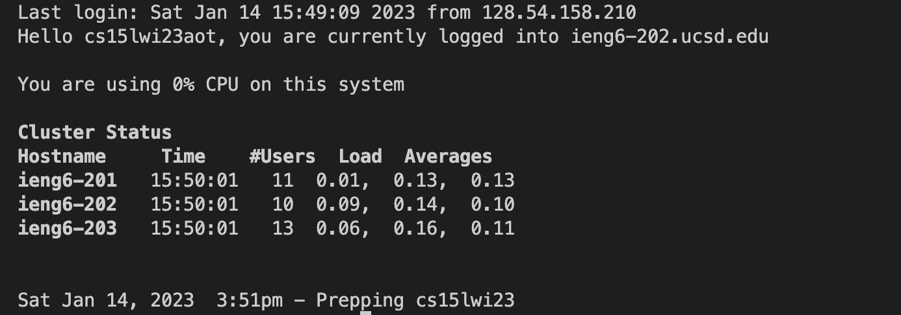
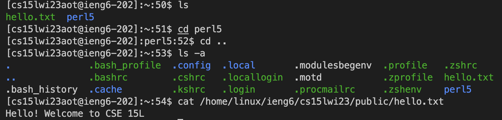
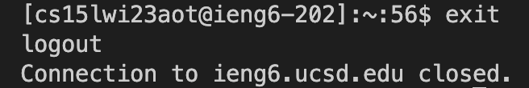

# Lab Report 1 - Remote Access and FileSystem
## How to Log Into Your 15L Account
**1. Installing VSCode**
* Click this [Link](https://code.visualstudio.com/) to download VSCode  
  It should redirect you to a website that looks like this  
  
* Select the version for your specific operating system and install it
* After you installed VSCode, load it up and you should get something similar to this:  
  
**Congratulations!! You successfully installed VSCode**
---
**2. Connecting to the Remote Server**
* I use a Mac so I did not have to do this but if you use Windows, follow the steps below
  * Install Git by using this [Link](https://gitforwindows.org/) It should bring you to a screen like this:  
  
  * After you installed Git, use this [Link](https://stackoverflow.com/questions/42606837/how-do-i-use-bash-on-windows-from-the-visual-studio-code-integrated-terminal/50527994#50527994) to use Bask on Windows in VSCode
* Open up a new terminal in VSCode by using pressing Ctrl or Command + and type in this command:  
  **ssh cs15lwi23aot@ieng6.ucsd.edu**  
  The account above is my specific account so make sure the letters after cs15lwi23 correspond to your own specific account
* After you typed that command in, you will get a message asking authenticity of the host. Just type yes and press enter
* It will then ask for your password. Input your password and you should get a message similar to this:  
  
**You are now connected to the remote server! Now you can start typing commands**
---
**3. Trying Some Commands**
* Now that you are on the remote server, you can start trying some commands. Here are some useful ones to get you started:
  * cd ~
  * cd 
  * ls -lat
  * ls -a
  * ls <directory> where directory is the path of a specific directory
  * cp /home/linux/ieng6/cs15lwi23/public/hello.txt ~/
  * cat /home/linux/ieng6/cs15lwi23/public/hello.txt
* Here's an example of what it looks like when you run some of these commands:  
  
* After you are done trying some commands, you can exit the remote server by either using Control-D or enter exit in the terminal  
  You would get something like this after you exit the remote server  
  
---
## Great Job! You now know how to long into your CS15l account and run commands on the remote server! You Did Fantastic!!
  
                                                                                   

  
